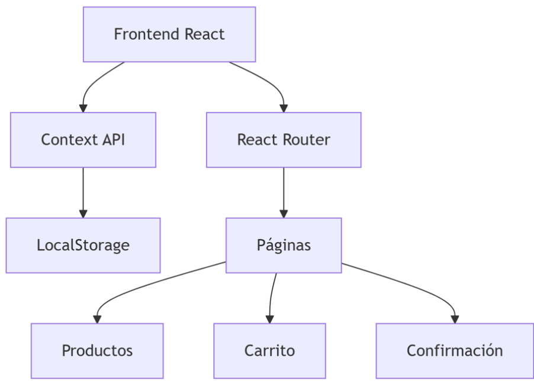

Es una aplicación web desarrollada con React que permite a los usuarios alquilar vehículos, gestionar reservas y realizar pagos simulados. El sistema incluye:
•	Catálogo interactivo de vehículos
•	Carrito de compras con persistencia
•	Gestión de requerimientos adicionales
•	Proceso de pago con validaciones

Arquitectura del Sistema

 Módulos Principales
 Gestión de Estado (CarritoContext.js)

Funciones clave:
// Reducer principal
case 'AGREGAR_PRODUCTO': 
  return { ...state, productos: [...state.productos, action.payload] };

case 'LIMPIAR_CARRITO':
  return initialState; // Restablece el estado

  Persistencia:

Guarda automáticamente en localStorage al cambiar el estado

Recupera datos al recargar la página

Flujo de Trabajo

Paso 1: Selección de Requerimientos

El usuario ingresa:

Nombre y dirección

Tipo de entrega (domicilio/recoger)

Presupuesto máximo

Paso 2: Catálogo de Productos
Datos mockeados en fakeApi.js
{
  id: 1,
  marca: "Toyota",
  modelo: "Corolla",
  precioDia: 120000,
  tipo: "Sedán"
}
Paso 3: Proceso de Pago

Validaciones estrictas:
// Validación de tarjeta
if (!/^\d{16}$/.test(tarjeta.numero)) {
  setError('Tarjeta inválida');
}

Cálculo automático de totales:

const total = subtotal + (entregaDomicilio ? 10000 : 0);

Componentes Clave
Productos.jsx	Muestra grid de vehículos con paginación
Carrito.jsx	Gestiona items, calcula totales y procesa pago
Confirmacion.jsx	Muestra resumen y limpia el carrito

 Validaciones

Tarjeta de crédito:

16 dígitos

Fecha MM/AA válida

CVV de 3 dígitos

Presupuesto: Bloquea pagos que excedan el límite
